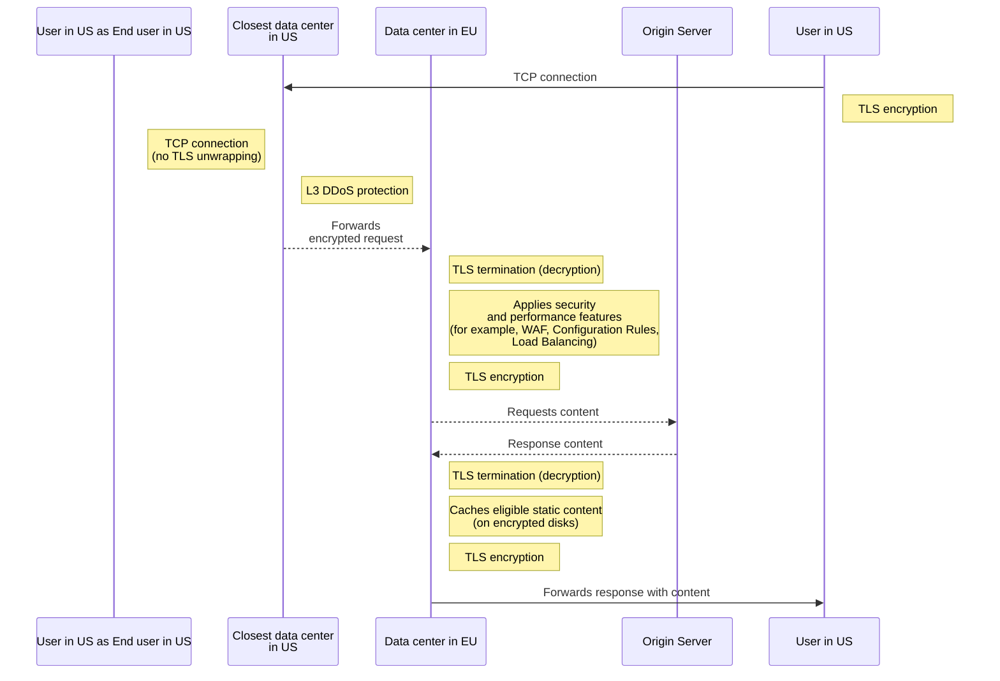

import { GlossaryTooltip, Steps } from "~/components";

Regional Services gives you the ability to accommodate regional restrictions by choosing which subset of data centers decrypt and service HTTPS traffic.

Regional Services receives and processes traffic within designated regions for customers who need to meet regional compliance requirements or have preferences for maintaining regional control over their data. Examples of use cases include accommodating regional restrictions like [GDPR](https://www.cloudflare.com/trust-hub/gdpr/) (General Data Protection Regulation), or fulfilling contractual agreements with customers that include geographic restrictions on data flows or data processing.

With Regional Services, TLS termination — the point at which encrypted HTTPS traffic is decrypted so Cloudflare can inspect and apply your security rules — only occurs inside the configured region. For example, if a hostname is configured to regionalize to the European Union (EU), any HTTPS request from the United States (US) will be forwarded in encrypted form to an EU data center before being decrypted.

## Global traffic management

Regional Services accepts traffic at any Cloudflare data center worldwide and applies [L3/L4 DDoS mitigations](/ddos-protection/about/attack-coverage/) — network-layer and transport-layer protections that block volumetric attacks without needing to decrypt traffic content. Meanwhile, security, performance, and reliability functions that require access to decrypted traffic are applied only at in-region Cloudflare locations.

Regional Services ensures that all of the following application-layer services (among others) operate within the selected region:

- Storing and retrieving content from Cache.
- Blocking malicious HTTP payloads with the Web Application Firewall (WAF).
- Detecting and blocking suspicious activity with Bot Management.
- Running Cloudflare Workers scripts.
- Load Balancing traffic to the best origin servers (or other <GlossaryTooltip term="endpoint">endpoints</GlossaryTooltip>).

## Request flow example

The following diagram is a high-level example of the flow of a request coming from an end user located within the US connecting to a website using Cloudflare Regional Services set to EU.

 

 

## Ways to use Regional Services

Regional Services regionalizes traffic through several mechanisms, depending on how your traffic reaches Cloudflare. Most customers use only one of these:

- **Regional Hostnames** — Regionalize proxied hostnames. You assign a region to a hostname through the [Regional Hostnames API](/data-localization/regional-services/regional-hostnames/) or the dashboard, and Cloudflare steers traffic for that hostname to in-region data centers. This is the most common option and is generally available. To set it up, refer to [Regional Hostnames](/data-localization/regional-services/regional-hostnames/).

- **Regionalized Spectrum Applications** — Regionalize [Spectrum](/spectrum/) HTTP/S applications. Spectrum applications use a separate regionalization mechanism from the Regional Hostnames API, and work with both [Spectrum Static IPs](/spectrum/about/static-ip/) and [Bring Your Own IP (BYOIP)](/byoip/). To set it up, refer to [Regionalized Spectrum Applications](/data-localization/regional-services/spectrum-applications/).

- **Regionalized IP Bindings** — Bind a [BYOIP](/byoip/) prefix to a region so that traffic destined for those IP addresses is processed in-region. Because bindings are managed through the API as address maps, this option is well suited to broad configurations (whole prefixes, zones, or accounts) and is fully self-serve once entitlements are enabled. This option requires the Regional Services and Regional Services for BYOIP entitlements. To set it up, refer to [Regionalized IP Bindings](/data-localization/regional-services/ip-bindings/).

The following table compares the three options to help you choose:

| Offering                                                                              | How traffic is addressed       | Granularity                        | Static IP / BYOIP        | API                          | Availability | Best for                                                       |
| ------------------------------------------------------------------------------------- | ------------------------------ | ---------------------------------- | ------------------------ | ---------------------------- | ------------ | -------------------------------------------------------------- |
| [Regional Hostnames](/data-localization/regional-services/regional-hostnames/)        | Cloudflare shared IPs  | Per hostname                       | Not supported            | Regional Hostnames API       | GA           | Most deployments; regionalizing specific proxied hostnames     |
| [Regionalized Spectrum Applications](/data-localization/regional-services/spectrum-applications/) | Dedicated IP via Spectrum app  | Per zone (all Spectrum HTTP/S apps) | Static IPs and BYOIP     | Spectrum API                 | GA           | Traffic addressed by IP that needs Static IPs or BYOIP         |
| [Regionalized IP Bindings](/data-localization/regional-services/ip-bindings/)         | BYOIP prefix at the IP layer   | Per CIDR / IP prefix (scales to whole prefixes) | BYOIP only               | Data Localization Suite API  | GA           | Broad, self-serve regionalization managed via address maps |

All three options support [managed regions](/data-localization/region-support/#region-types). [Custom regions](/data-localization/region-support/#region-types) are available for Regionalized Spectrum Applications and Regionalized IP Bindings, but not for Regional Hostnames.

:::note[A note on naming]

These options were previously labeled with version numbers (Regional Services v1 and v2). Cloudflare is moving away from those labels: the version numbers implied that each option superseded the last, when in fact each is a distinct approach with its own tradeoffs. None is strictly better than the others — the right choice depends on how your traffic reaches Cloudflare and which use case you need to support. The current names describe what each option does so you can choose accordingly.

The following table maps the current names to terms you might have seen elsewhere:

| Current name                       | Previously known as                                    | Availability         |
| ---------------------------------- | ------------------------------------------------------ | -------------------- |
| Regional Hostnames                 | Regional Services v2 (RSv2)                            | GA                   |
| Regionalized Spectrum Applications | Regional Services v1 (RSv1)                            | GA                   |
| Regionalized IP Bindings           | Regional Services for BYOIP, regionalized address maps | GA                   |

:::

## Get started

Setting up Regional Services follows the same path regardless of which option you choose:

<Steps>

1. **Confirm your entitlements.** Regional Services is an Enterprise add-on. Contact your account team to confirm your account has the required entitlements. Some options have additional requirements — Regionalized Spectrum Applications also need [Spectrum](/spectrum/), and Regionalized IP Bindings also need the Regional Services for BYOIP entitlement.

2. **Choose the option that matches how your traffic reaches Cloudflare.** Use the [comparison table](#ways-to-use-regional-services) to decide between the three options.

3. **Follow the setup guide for your option.**

   - [Regional Hostnames](/data-localization/regional-services/regional-hostnames/)
   - [Regionalized Spectrum Applications](/data-localization/regional-services/spectrum-applications/)
   - [Regionalized IP Bindings](/data-localization/regional-services/ip-bindings/)

4. **Verify regionalization.** Confirm that traffic is processed in your configured region. Refer to [Verify Regional Services behavior](/data-localization/how-to/#verify-regional-services-behavior).

</Steps>

## Additional information

For more details about the products that are compatible with Regional Services, refer to the [Cloudflare product compatibility](/data-localization/compatibility/) page. If you have purchased these products as part of your Enterprise subscription plan, Cloudflare will only terminate TLS connections for these products in the geographic region you have configured for Regional Services.
